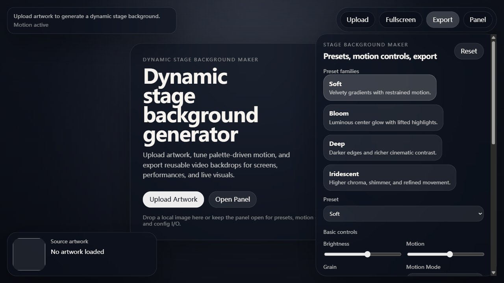

# Dynamic Stage Background Maker

一个用于生成动态舞台背景的浏览器工具。它可以从本地图片中提取色彩，生成带有柔和运动、渐变、光晕和颗粒质感的可循环视觉背景，适合舞台屏幕、演示开场、VJ 视觉和活动现场使用。

Repository: <https://github.com/lssnake0105/Dynamic-Stage-Background-Maker>

## 预览



## 项目亮点

- 从本地图片自动提取主色并生成动态背景
- 提供多组视觉预设和 9 种效果模式：Mesh Gradient、Aura、Silk、Liquid、Nebula、Turbulence、Diffusion、Foliage、Mist
- 支持速度、柔化、运动强度、网格密度、亮度、暗角、光雾和颗粒控制
- 支持 Fill / 16:9 画幅切换和隐藏控制面板的纯净预览模式
- 支持 480p、720p、1080p WebM 视频导出
- 支持场景配置 JSON 导出和导入，便于复用同一套视觉方案
- 支持静态模式，适配需要稳定画面的场景

## 技术栈

- Vite
- 原生 JavaScript 模块
- Canvas 2D 动态渲染
- MediaRecorder WebM 导出

## 开发

```bash
npm install
npm run dev
```

## 构建

```bash
npm run build
npm run preview
```

构建产物会输出到 `build/`。

## 使用方式

1. 点击 `Upload` 或将图片拖入页面左侧的封面区域。
2. 选择预设、效果模式和 Fill / 16:9 画幅。
3. 调整速度、柔化、运动、色彩和质感参数。
4. 选择导出分辨率和时长。
5. 点击 `Export` 导出动态舞台背景视频。

## 快捷键

- `P`：显示或隐藏控制面板
- `H`：进入或退出纯净预览模式

## 目录结构

```text
src/
  core/        渲染、调色板、场景、时间线和导出逻辑
  ui/          页面外壳、控件绑定和交互逻辑
docs/          README 展示用项目快照
```

## 项目定位

这个项目面向需要快速生成现场视觉素材的个人创作者和小型活动场景。它适合作为可直接运行的动态背景生成器原型，也可以继续扩展为带有更多预设、音频响应、批量导出和现场控制能力的舞台视觉工具。
